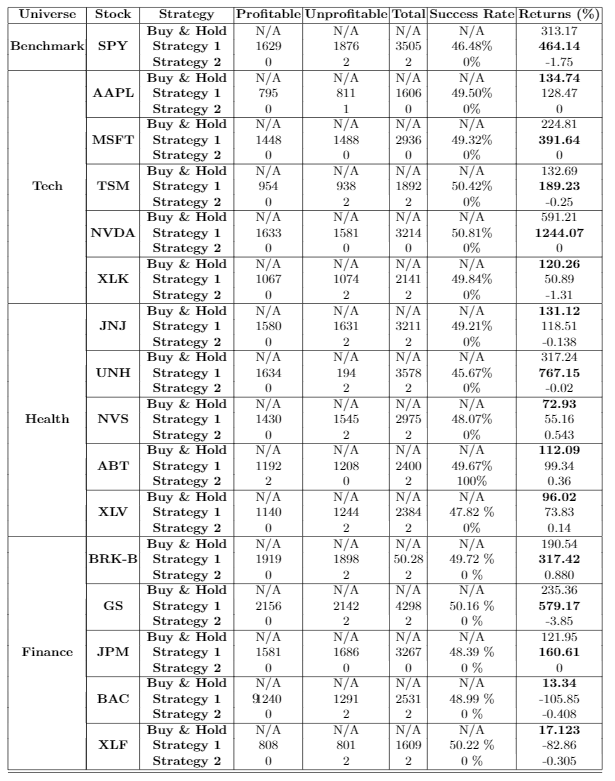

# convoluted-stock-market

- [x] Pick stock
- [x] Determine benchmark to beat  (SPY, sectors, buy and hold)
- [x] Determine the sample data  - (maybe 4 hours)
- [x] Download data (2010 to today) - Chaim
- [x] Plot stock raw data - Adam
- [x] Convert to percentages and plot (OOP) - Ethan, Yigit, 
- [x] Implement the metric - Ethan
- [x] Convolution operation - Ethan
- [x] Determine and report buy and hold value for the carnival - Yigit
- [x] Fit model via gradient descent to determine the patterns (implement h(t)) - Yigit 
- [x] Report consolidation breakout profits - Yigit
- [x] Implement pipeline code - Yigit
 
## Development
- `conda create --name convoluted_stock_market_env python=3.6` (Do it once)
- `conda activate convoluted_stock_market_env`
- `pip install -r requirements.txt`

## Stocks
https://finviz.com/screener.ashx?v=121&f=cap_mega,sec_financial,sh_avgvol_o1000,sh_curvol_o1000&ft=4&o=-marketcap
Mega Cap Stocks from sectors whose average volume is greater than 1M.

### Index
- SPY

### Technology Dataset
- AAPL
- MSFT
- TSM
- NVDA
- XLK

### Health Care Dataset
- JNJ
- UNH
- NVS
- ABT
- XLV

### Finance Dataset
- BRK-B
- V
- JPM
- MA
- XLF

## Current Results

